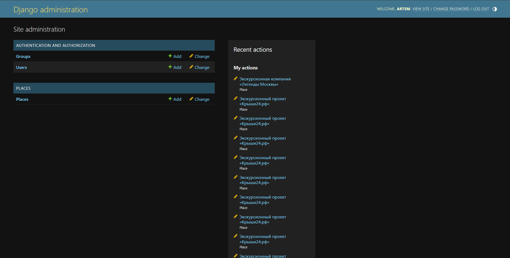

# Куда сегодня пойти


___
#### Данная программа запускает [сайт](http://artem228gkrut.pythonanywhere.com/) с популярными местами на карте Москвы.
___
### Содержание:
* [Запуск](https://github.com/Artuom4ik/where_to_go#%D0%B7%D0%B0%D0%BF%D1%83%D1%81%D0%BA)
* [Переменные окружения](https://github.com/Artuom4ik/where_to_go#%D0%BF%D0%B5%D1%80%D0%B5%D0%BC%D0%B5%D0%BD%D0%BD%D1%8B%D0%B5-%D0%BE%D0%BA%D1%80%D1%83%D0%B6%D0%B5%D0%BD%D0%B8%D1%8F)
* [Как добавить свои места](https://github.com/Artuom4ik/where_to_go#%D0%BA%D0%B0%D0%BA-%D0%B4%D0%BE%D0%B1%D0%B0%D0%B2%D0%B8%D1%82%D1%8C-%D1%81%D0%B2%D0%BE%D0%B8-%D0%BC%D0%B5%D1%81%D1%82%D0%B0)
* [Пример рабочего сайта](https://github.com/Artuom4ik/where_to_go#%D0%BF%D1%80%D0%B8%D0%BC%D0%B5%D1%80-%D1%80%D0%B0%D0%B1%D0%BE%D1%87%D0%B5%D0%B3%D0%BE-%D1%81%D0%B0%D0%B9%D1%82%D0%B0)
* [Цель проекта](https://github.com/Artuom4ik/where_to_go#%D1%86%D0%B5%D0%BB%D1%8C-%D0%BF%D1%80%D0%BE%D0%B5%D0%BA%D1%82%D0%B0)
___
### Запуск

Для запуска блога у вас уже должен быть установлен Python 3.1 или выше.

- Скачайте код
- Установите зависимости командой `pip install -r requirements.txt`
- Запустите сервер командой `python3 manage.py runserver`

После этого переходите по ссылке [127.0.0.1:8000](http://127.0.0.1:8000), вы увидите главную страницу.
___
### Переменные окружения:

Часть настроек проекта берётся из переменных окружения. Чтобы их определить, создайте файл `.env` рядом с `manage.py` и запишите туда данные в таком формате: `ПЕРЕМЕННАЯ=значение`.

**Для запуска проекта эти настройки не требуются**, значения уже проставлены по умолчанию.

Доступны следущие переменные:
- `DEBUG` — дебаг-режим. Поставьте `True`, чтобы увидеть отладочную информацию в случае ошибки. Выключается значением `False`.
- `SECRET_KEY` — секретный ключ проекта. Например: `erofheronoirenfoernfx49389f43xf3984xf9384`.
___
### Как добавить свои места

Можно использовать два способа добавления свих мест в БД - это через админку и напрямую через кансоль.

##### Добавление через админ панель

Для того, чтобы добавить своё место через админ панель, вам потребуется выполнить ряд действий:
 
* Создать пользователя для админ панели, для этого в кансоли напишите такую команду:

```
python manage.py createsuperuser
```

* Далее вам потребуется указать имя пользоватьля и пароль, если вы не хотите писать имя пользователя, то Django по умолчанию выставит имя `maste`.

* После того, как вы успешно создали пользователя, перейдите в админ панель и введите ранее заполненые данные когда вы создавали пользователя. [Сыллка](http://127.0.0.1:8000/admin/) на админ панель.



* Как только вы попадёте в админ панель, перейдите во вкладку `Places`. 


* Вы увидите список уже раннее добавленных мест. Нажмите на кнопку `add place`.


* Далее у вас откроется редактор в котором вы сможете добавить своё место.


* Для сохранения нажмите кнопку `save`, она находится в самом низу страницы.


##### Добавление через консоль

Если у вас имеется `json` файл со всему нужными данными, то вы сможете намного проще добавить своё место в `БД`.

* Пример `json` файла:


* Для добавления своего места в `БД`, напишите в консоль команду:

```
python manage.py load_place http://адрес/файла.json
```

* Далее в `БД` добавиться ваше место.

___
### Пример рабочего сайта


___
### Цель проекта:
* Код написан в образовательных целях.

